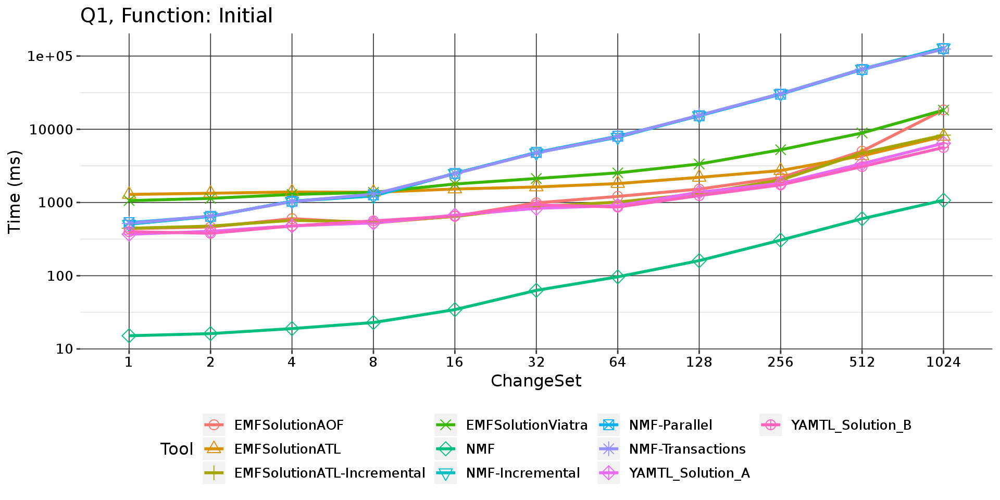
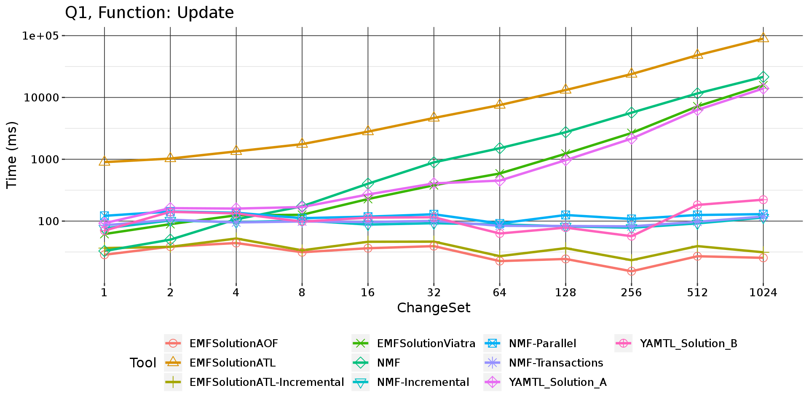

# The TTC 2018 Social Media Case

This repository is a fork of the original repository. It contains the most recent versions of the EMFSolutionAOF and EMFSolutionATL-Incremental solutions.

The following results show that these solutions are well-positioned compared to the others.
There were obtained by running the benchmark on a machine with
- 2 x Intel® Xeon® X5670 - 2.93GHz 6-core
- 12 x 16 GB PC3-8500 (DDR3-1066Mhz) Registered CAS-7

## Case description

The `docs/2018_TTC_Live.pdf` file contains the [case description](https://github.com/TransformationToolContest/ttc2018liveContest/raw/master/docs/2018_TTC_Live.pdf).

## Prerequisites

* 64-bit operating system
* Python 2.7 or higher
* R

## Solution Prerequisites

* NMF: You need to install [.NET Core 2.0](https://www.microsoft.com/net/download/linux-package-manager/ubuntu16-04/sdk-current)

Add your prerequisites here!

## Using the framework

The `scripts` directory contains the `run.py` script.
At a first glance, invoke it without any arguments so that the solution will be built, benchmarked, running times visualized and the results compared to the reference solution's.
One might fine tune the script for the following purposes:
* `run.py -b` -- builds the projects
* `run.py -b -s` -- builds the projects without testing
* `run.py -g` -- generates the instance models
* `run.py -m` -- run the benchmark without building
* `run.py -v` -- visualizes the results of the latest benchmark
* `run.py -e` -- compare results to the reference output. The benchmark shall already been executed using `-m`.
* `run.py -m -e` -- run benchmark without building, then extract and compare results to the reference output
* `run.py -t` -- build the project and run tests (usually unit tests as defined for the given solution)

The `config` directory contains the configuration for the scripts:
* `config.json` -- configuration for the model generation and the benchmark
* `reporting.json` -- configuration for the visualization

### Running the benchmark

The script runs the benchmark for the given number of runs, for the specified tools and change sequences.

The benchmark results are stored in a CSV file. The header for the CSV file is stored in the `output/header.csv` file.

## Reporting and visualization

Make sure you read the `README.md` file in the `reporting` directory and install all the requirements for R.

## Implementing the benchmark for a new tool

To implement a tool, you need to create a new directory in the solutions directory and give it a suitable name.
